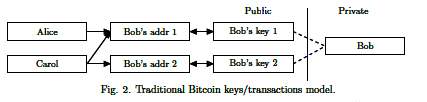
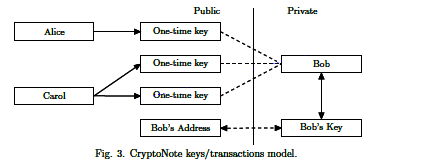
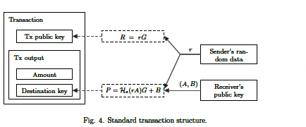
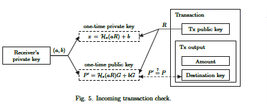
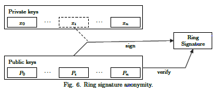

# Inizio dello sviluppo e storia dell'algoritmo

Dato che Bitcoin fallisce dal punto di vista della privacy delle transazioni e della resistenza agli ASICs (*Application Specific Integrated Circuits*), lo sviluppatore **Nicolas van Saberhagen**, che molti pensano essere un nome di fantasia, con alcune speculazioni che lo associerebbero al fantomatico creatore di Bitcoin, **Satoshi Nakamoto**, nel 12 dicembre 2012 presenta un documento con all'interno l'idea di  **CryptoNote**. 

Questo innovativo protocollo di consenso viene presentato come una fattibile alternativa ai meccanismi tradizionali utilizzati dalle criptomonete, come la *Proof-Of-Work* di Bitcoin (la prova che sei in grado di eseguire un lavoro), oltretutto in grado di garantire elevati livelli di anonimato e un opportuna resistenza agli ASICs. Alcune delle funzioni menzionate riguardavano transazioni di dimensione inferiore e non facilmente associabili ad un utente, l'utilizzo delle firme ad anello volte a migliorare la sicurezza e respingere gli attacchi alla blockchain e l'adattamento dinamico della emissione di moneta.

## Sviluppo dello standard CryptoNight e adozione

Qualche mese dopo, gli sviluppatori Seigen, Max Jameson, Tuomo Nieminen, Neocortex e Antonio M. Juarez, pubblicano un documento, facente parte degli standard di CryptoNote, con all'interno la descrizione della funzione di hash per la proof-of-work di CryptoNote, chiamata **CryptoNight**.
Viene presentata come una funzione *memory-hard*, quindi  resistente come algoritmo crittografico agli attachi effettuati cercando di ridurre la complessità aumentando le risorse hardware, progettata per essere inefficiente su GPU, FPGA e ASICs rispetto alle classiche funzioni utilizzate nella *proof-of-work*, come ad esempio *SHA-256*. 

**Bytecoin (BCN)** è stata la prima criptomoneta ad adottare il protocollo di consenso CryptoNote, scelta giustificata dalla volontà dei fondatori di avere una criptomoneta volta alla privacy finanziaria, attraverso una protezione completa dell'utente che utilizza gli strumenti finanziari messi a disposizione, dalle transazioni all'identità personale. Come altre differenze, abbiamo l'aggiustamento della difficoltà di minare nuova moneta ad ogni blocco, generando un blocco ogni due minuti circa. Nonostante le buone premesse, la moneta oggi ha un *market cap* irrisorio e non è stata adottata a causa di svariati problemi: 
- Inizialmente, la moneta è stata pre-minata, fornendo l'80% delle monete ad un gruppo di *early adopters*, generando una distribuzione iniqua e sleale
- Bytecoin ha avuto vari problemi tecnici di instabilità nel corso della sua vita, con difficoltà da parte degli utenti che partecipavano alla rete impossibilitati a sincronizzare tutta la blockchain.
- Il 20 dicembre 2017, la rete di Bytecoin ha ricevuto un attacco DDoS massiccio, con lo scopo di rubare le monete e distribuire la potenza tra le varie monete che adottano lo standard CryptoNote. Gli utenti affetti erano soprattutto chi aveva un software non aggiornato per minare nuova moneta e chi utilizzava *desktop wallets* e *web wallets* si è visto rallentare o disabilitare la sincronizzazione dei pagamenti, cosa che ha aumentato lo sconforto dei suoi partecipanti alla rete
- Non si hanno notizie riguardo futuri sviluppi della moneta, con l'ultimo post che prometteva lo sviluppo di una tecnologia per nascondere gli importi delle transazioni e di creare un wallet più efficiente e sicuro, risalente al 2019.

\
Un'altra moneta, chiamata **Monero (XMR)**, nel aprile 2014 adottò CryptoNote, scelto per garantire la privacy e la decentralizzazione del mining. La decisione di utilizzare questa tecnologia è stata una dei fattori che hanno contibuito alla crescita della reputazione e al successo di Monero come una delle monete digitali più promettenti e utilizzate. Monero ha avuto un ruolo cruciale nello sviluppo attivo di CryptoNight, introducendo varie modifiche al fine di adattare la funzione alle proprie necessità. Alcune versioni utilizzate erano specifiche per miners con risorse limitate per il mining, altre sono state rilasciate per ottimizzare l'efficienza e l'equità del mining, oltre a mantenere la resistenza agli ASIC. 
Nonostante ciò, nel 2019 Monero decise di cambiare il suo algoritmo da CryptoNote a RandomX, di cui forniremo una descrizione data l'affinità e i prinicipi che ne dominano lo sviluppo, oltre che risolvere una serie di problemi che si erano sviluppati nell'algoritmo di CryptoNight.

Di seguito forniremo una panoramica sulla tecnologia CryptoNote, presentando un approccio dettagliato e analitico per comprenderne non solo gli aspetti funzionali e tecnici dell'algoritmo ma anche le intrinseche necessità di migliorare lo stato corrente degli algoritmi *Proof-Of-Work*, incrementando privacy e anonimato.

# Aspetti tecnici di CryptoNote 

## Privacy e Anonimato nel Cash Elettronico

Bitcoin rappresenta una implementazione di successo del concetto di cash
elettronico p2p, provando la sua semplicità (come i soldi cartacei) e la
sua convenienza (come le carte di credito).\
Sfortunatamente Bitcoin ha alcune carenze purtroppo, per esempio la
natura del sistema distribuito non è flessibile , prevenendo
l'implementazione di nuove features fino a quando quasi tutti gli utenti
della rete aggiornano i loro client. In questo modello non flessibile è
più semplice pensare ad un nuovo progetto che invece cercare di fixare
quello vecchio. CryptoNote propone soluzioni ai difetti principali di
Bitcoin , nome che enfatizza la futura svolta nel mondo del cash
elettronico.

Privacy e anonimato sono gli aspetti più importanti del cash
elettronico. I pagamenti peer-to-peer cercano di essere nascosti dal
punto di vista di terze parti, una netta differenza rispetto alle banche
tradizionali. In generale le compagnie non vogliono rivelare le loro
transizioni interne e le persone comuni non vogliono comunicare nessuna
informazione in merito alle spese personali.

## Proprietà di Irretracciabilità e Non Collegabilità

Per definire il concetto di sistema di pagamento anonimo servono due
proprietà:

- Irretracciabilità: per ogni transizione in entrata tutti i possibili
mittenti sono equiprobabili
- Non collegabilità: per due qualsiasi transizioni in uscita è
impossibile dimostrare che sono state inviate dalla stessa persona

## Limiti di Bitcoin

Bitcoin non soddisfa però il primo criterio, dato che tutte le
transazioni che avvengono sono pubbliche e possono essere ricondotte a
un\'unica origine e ad un unico destinatario.\
Inoltre Bitcoin non sembra soddisfare neanche la seconda proprietà, da
un attenta analisi della blockchain si potrebbe rilevare una connessione
tra gli utenti e le loro transazioni.\
L'incapacità di Bitcoin di soddisfare le due proprietà ci porta a
concludere che non si tratta si tratta di un sistema anonimo ma
pseudo-anonimo. Sono state proposte diverse soluzioni, basate sull'idea
di mescolare diverse transazioni pubbliche e inviarle tramite un
indirizzo intermediario ma questo porta un altro inconveniente ovvero
una terza parte fidata.

## Problemi del Protocollo di Consenso di Bitcoin

Il creatore di Bitcoin Satoshi Nakamoto ha descritto il protocollo di
consenso come "one-CPU-one-vote", utilizzando SHA-256 per lo schema
della proof-of-work. Dal momento che gli utenti votano per l\'ordine
unico della cronologia delle transazioni, la ragionevolezza e la
coerenza di questo processo sono condizioni fondamentali per l\'intero
sistema.
Ci sono due aspetti da sottolineare:
- La rete è fuori pericolo se il 51% del potere di mining è sotto il
controllo di utenti onesti.
- Il progresso del sistema è limitato perché se si vuole cambiare la
versione del protocollo il cambiamento avverrà solo se supportato dalla
stragrande maggioranza degli utenti.

Questo permette di ipotizzare le proprietà che devono essere soddisfatte
da una funzione di proof-of-work, ovvero questa funzione non deve
consentire ad un partecipante della rete di ottenere un vantaggio
significativo rispetto ad un altro, ci vuole una sorta di equivalenza
tra hardware comune e dispositivi ad alto costo. SHA-256 non ha queste
caratteristiche: una GPU è più efficacie di una CPU e i dispositivi ASIC
sono più potenti delle GPU.\
Bitcoin crea quindi delle condizioni favorevoli per un ampio divario tra
potere di voto dei partecipanti, violando il principio di
"one-CPU-one-vote" dato che i proprietari di GPU e ASIC hanno molto più
potere di voto rispetto a chi ha delle GPU.\
\
Il sistema di script in Bitcoin è troppo complicato e pesante.
Potenzialmente consente di creare transazioni sofisticate, ma alcune
delle sue funzionalità sono disabilitate per motivi di sicurezza.\

## Protocolli di Firma e schemi di CryptoNote
Seguono ora degli schemi di transazioni completamente anonime che
soddisfano le condizioni di non irretracciabilità e non collegabilità.
Una caratteristica importante è l'autonomia: il mittente non è tenuto a
collaborare con altri utenti o terze parti per le transazioni.

Lo schema di CryptoNote si basa su una primitiva crittografica chiamata
*group signature*, inventata da D.Chaun e E. van Heyst che consente di
firmare un messaggio per conto di un gruppo.\
Dopo aver firmato, l'utente fornisce (per verificare) non la propria
chiave pubblica, ma le chiavi di tutti gli utenti del suo gruppo. Chi
verifica vede che il vero firmatario è un membro di questo gruppo, ma
non conosce la sua esatta identità.\
Il protocollo originale prevedeva una Terza Parte Fiduciosa (Gestore del
Gruppo), ed era l'unico che poteva risalire al reale firmatario. La
versione successiva, *ring* *signature*, introdotta da Rivest ,era uno
schema ad anello autonomo senza Responsabile del Gruppo e con revoca
dell'anonimato. Sono apparse diverse modifiche successivamente, quella
che viene adottata su CryptoNote si basa sullo studio "Traceable ring
signature" di E. Fujisaki and K. Suzuki . Per distinguere l\'algoritmo
originale da quello modificato , chiameremo quest\'ultima firma
*one-time ring signature*, sottolineando la capacità dell\'utente di
produrre una sola firma valida con la chiave privata.
La proprietà di tracciabilità è stata indebolita, mantenendo però quella
di linkability per fornire unicità:
la chiave pubblica può apparire in set di verifica stranieri e la chiave
privata può essere usata per generare una firma anonima univoca. In caso
di un tentativo di doppia spesa (un singolo unità di valuta digitale
viene spesa più di una volta), queste due firme saranno collegate tra
loro, ma rivelare l\'identità del firmatario non è necessario per i
nostri scopi.

Alla base dell'algoritmo di firma si usa EdDSA, sviluppato e
implementato da D.J. Bernstein, parametri comuni di dominio sono:
- q: numero primo;
- d: elemento of Fq;
- E: equazione della curva ellittica;
- G: punto base;
- l: ordine primo del punto base;
- Hs: funzione hash crittografica {0, 1} ∗ → Fq;
- Hp: funzione hash deterministica E(Fq) → E(Fq).

Una maggiore privacy richiede alcuni nuovi termini che non dovrebbero
essere confusi con le entità di Bitcoin:

- **private ec-key** è una chiave segreta standard di curva ellittica: un
numero 𝑎 ∈ \[1,𝑙−1\]

- **public ec-key** è una chiave pubblica standard di curva ellittica: un
punto 𝐴=𝑎𝐺;

- **one-time keypair** è una coppia di chiavi ec-private e ec-public;

- **private user key** è una coppia (a, b) di due diverse chiavi
ec-private;

- **tracking key** è una coppia (a, B) di chiave ec-private e chiave
ec-public (dove 𝐵=𝑏𝐺 e 𝑎≠𝑏);

- **public user key** è una coppia (A, B) di due chiavi ec-public derivate
da (a, b);

- **standard** **address** è una rappresentazione di una chiave utente
pubblica mediante una stringa digitabile dall\'utente con correzione
degli errori.

La struttura generale della transazione rimane quasi identica a quella
di Bitcoin: ogni utente può scegliere diversi pagamenti (transaction
outputs), firmarli con le corrispondenti chiavi private e inviarli a
diverse destinazioni.\
Contrariamente al modello di Bitcoin, dove un utente possiede sia le
chiavi uniche private e pubbliche, in questo modello un mittente genera
una chiave one-time basata sull'indirizzo del destinatario e su alcuni
dati. In questo senso, una transazione in entrata per lo stesso
destinatario viene inviata a una chiave pubblica una tantum (non
direttamente a un indirizzo unico) e solo il destinatario può recuperare
la parte privata corrispondente per riscattare i suoi fondi (utilizzando
la sua chiave privata unica). Il destinatario può spendere usando la
struttura ad anello, mantenendo anonimi il suo possesso e la sua spesa
effettiva.

## Funzionamento delle transazioni

Gli indirizzi Bitcoin classici, una volta pubblicati, diventano
identificatori univoci per ogni pagamento in entrata, collegandoli tra
loro e legandoli al destinatario. 

 

Viene proposta una soluzione che
consente all\'utente di pubblicare un singolo indirizzo e ricevere
pagamenti incondizionati e non collegabili. La destinazione di ciascun
output (di default) è una chiave pubblica unica, derivata
dall\'indirizzo del destinatario e dall\'iniezione di dati casuali da
parte del mittente.\

Innanzitutto, il mittente esegue il protocollo di scambio Diffie-Hellman
per ottenere un segreto condiviso dai suoi dati e da una metà
dell\'indirizzo. Poi calcola una chiave di destinazione una tantum,
utilizzando questi segreti e la seconda metà. Per questi due passaggi
sono necessarie due chiavi ec-keys del destinatario; quindi, un
indirizzo CryptoNote standard è grande quasi il doppio di un indirizzo
Bitcoin. Il destinatario esegue anche il protocollo Diffie-Hellman e poi
recupera la chiave segreta corrispondente.

Una sequenza di transazione standard procede come segue:

1.  Alice vuole inviare un pagamento a Bob, che ha pubblicato il suo
    indirizzo. Lo decomprime e ottiene la chiave utente pubblica di Bob (A, B).

2.  Alice genera un numero casuale 𝑟 ∈\[1,𝑙−1\] e calcola la chiave
    pubblica one-time 𝑃=𝐻𝑠(𝑟𝐴)𝐺+𝐵.

3.  Alice usa 𝑃 come chiave di destinazione per l\'output e inserisce
    anche il valore 𝑅=𝑟𝐺 (come parte del protocollo Diffie-Hellman) da
    qualche parte nella transazione. Alice può creare altri output con
    chiavi pubbliche uniche: chiavi diverse dei destinatari (𝐴𝑖,𝐵𝑖)
    implicano 𝑃𝑖​ diversi anche con lo stesso 𝑟.

    

4.  Bob controlla ogni transazione in arrivo con la sua chiave privata
    (a, b), calcolando 𝑃′=𝐻𝑠(𝑎𝑅)𝐺+𝐵. Se la transazione di Alice è
    presente, allora 𝑎𝑅=𝑎𝑟𝐺=𝑟𝐴 e 𝑃′=𝑃.

5.  Ora Bob può recuperare la chiave privata una tantum corrispondente:
    𝑥=𝐻𝑠(𝑎𝑅)+𝑏, così come 𝑃=𝑥𝐺. Può spendere questo output in qualsiasi
    momento firmando la transazione con 𝑥.

    

Di conseguenza, Bob riceve pagamenti in entrata associati a chiavi
pubbliche una tantum che non possono essere collegate a un osservatore
esterno.

### Firme ad anello

Un protocollo basato su firme ad anello una tantum consente agli utenti
di ottenere un\'anonimato incondizionato. Purtroppo, i tipi ordinari di
firme crittografiche permettono di tracciare le transazioni ai
rispettivi mittenti e destinatari. La soluzione proposta usa diverse
tipi di firme, consiste di quattro algoritmi (**GEN, SIG, VER, LNK**).

- **GEN** prende parametri pubblici e restituisce una coppia ec (P, x) e
una chiave pubblica I.\
- **SIG** riceve un messaggio m, un insieme S' di chiavi pubbliche
{Pi}i≠s, le coppie (Ps, xs) e restituisce una firma σ e un insieme S =
S' ∪ {Ps}.\
- **VER** riceve un messaggio m, un insieme S, una firma σ e restituisce
\"true\" o \"false\".\
- **LNK** riceve un insieme I = {Ii}, una firma σ e restituisce \"linked\"
o \"indep\".

Lo scopo principale del protocollo è il seguente: un utente produce una
firma che può essere verificata non da una singola chiave pubblica, ma
da un insieme di chiavi. Il vero firmatario è indistinguibile dagli
altri proprietari di chiavi fino a quando non produce la seconda firma
sotto la stessa coppia di chiavi.

- **GEN**: Il firmatario sceglie casualmente una chiave segreta 𝑥 ∈
\[1,𝑙−1\] e calcola la chiave pubblica corrispondente 𝑃=𝑥𝐺. Inoltre,
calcola un\'altra chiave pubblica 𝐼=𝑥𝐻𝑝(𝑃) chiamata \"immagine della
chiave\".
- **SIG**: Il firmatario genera una firma ad anello one-time con una prova
a conoscenza zero non interattiva. Seleziona un sottoinsieme casuale 𝑆'​
di n - 1 chiavi pubbliche di altri utenti 𝑃𝑖, la propria coppia di
chiavi (x, P) e l\'immagine della chiave I. Sia 1≤𝑠≤𝑛 l\'indice segreto
del firmatario in S (in modo che la sua chiave sia 𝑃𝑠).\
Si sceglie casualmente un elemento casuale da {qi \| i = 1 \... n} e {wi
\| i = 1 \... n, i ≠ s} da (1 \... l) e effettua i seguenti passaggi:\

Chi verifica controlla se $$\sum_{i=1}^{n} ci =^? H_s(m,L_1',...,L_n',R_1',...R_n') \mod l $$

Se questa uguaglianza è vera, chi verifica esegue l\'algoritmo **LNK**,
altrimenti respinge la firma.
- **LNK**: Chi verifica controlla se I è stata utilizzata in firme passate
(questi valori sono memorizzati nell\'insieme I). Un doppio utilizzo
significa che sono state prodotte due firme con la stessa chiave
segreta.\
Meccanismo del protocollo: utilizzando L-commitments, il firmatario
dimostra di conoscere un certo 𝑥 tale che almeno una 𝑃𝑖=𝑥𝐺. Per rendere
questa prova non ripetibile introduciamo l\'immagine della chiave come
𝐼=𝑥𝐻𝑝(𝑃). Il firmatario utilizza gli stessi coefficienti (𝑟𝑖,𝑐𝑖) per
dimostrare quasi la stessa cosa: egli conosce un certo 𝑥 tale che almeno
uno 𝐻𝑝(𝑃𝑖)=𝐼⋅𝑥\^−1. Se 𝑥→𝐼 è iniettiva:

    - Nessuno può recuperare la chiave pubblica dall\'immagine della chiave
e identificare il firmatario;

    - Il firmatario non può fare due firme con I diverse e lo stesso x.

Con una firma ad anello one-time, Bob può efficacemente nascondere
l'output di Alice (cioè, il suo input) tra gli altri: tutti i possibili
spenditori saranno equiprobabili, anche se Alice non ha più informazioni
di qualsiasi osservatore. Bob specifica n-1 outputs, non sapendo se
alcuni di questi sono stati spesi:\
Un output può essere utilizzato in migliaia di firme come fattore di
ambiguità e mai come obiettivo di occultamento. Il controllo di doppia
spesa avviene nella fase LNK quando si cerca nell\'insieme delle
immagini di chiave utilizzate.\
Bob può scegliere il grado di ambiguità autonomamente: n = 2 significa
che avrà speso l\'output con una probabilità del 50%, n = 100 dà il 1%.
La dimensione della firma risultante è lineare O(n), quindi l\'anonimato
costa a Bob una dimensione di transazione più grande e commissioni più
alte.

Combinando entrambi i metodi (chiavi di transazione one-time e firme ad
anello one-time), Bob raggiunge un nuovo livello di privacy rispetto
allo schema originale di Bitcoin. Gli basta memorizzare una sola chiave
privata (a, b) e generare una chiave pubblica (A, B) per iniziare a
ricevere e inviare transazioni anonime. Per ogni output Bob recupera
coppie di chiavi di transazione uniche (pi, Pi) che non possono essere
collegate tra loro o alla sua chiave pubblica. Può spendere ognuna di
esse, firmando ogni input con una firma ad anello non tracciabile.

## Miglioramenti nella PoW rispetto a Bitcoin

C'è stato anche un miglioramento dell'algoritmo di PoW, come obiettivo
primario vi è l'abbassamento del gap tra CPU e GPU/FPGA/ASIC.\
Il protocollo originale di proof-of-work di Bitcoin utilizza la funzione
SHA-256.\
Consiste principalmente di operatori logici di base e si basa
esclusivamente sulla velocità computazionale del processore, quindi è
perfettamente adatto per l\'implementazione multicore/conveyer.
Tuttavia, i computer moderni non sono limitati solo dal numero di
operazioni al secondo, ma anche dalla dimensione della memoria. Mentre
alcuni processori possono essere notevolmente più veloci di altri, le
dimensioni della memoria sono meno probabili che varino tra le
macchine.\
L\'idea principale è costruire un algoritmo che alloca un ampio blocco
di dati (\"scratchpad\") all\'interno della memoria e \"accedere a una
sequenza imprevedibile di posizioni\" in esso. Il blocco dovrebbe essere
sufficientemente grande per rendere più vantaggioso conservare i dati
piuttosto che ricalcolarli ad ogni accesso. L\'algoritmo dovrebbe
inoltre impedire il parallelismo interno, quindi N thread simultanei
dovrebbero richiedere N volte più memoria contemporaneamente.\
Dwork et al \[29\] hanno investigato e formalizzato questo approccio,
portandoli a suggerire un\'altra variante della funzione di pricing:
\"Mbound\". Un altro lavoro appartiene a F. Coelho \[30\], che ha
proposto la soluzione più efficace: \"Hokkaido\". Per quanto ne
sappiamo, l\'ultimo lavoro basato sull\'idea di ricerche pseudo-casuali
in un grande array è l\'algoritmo noto come \"scrypt\" di C. Percival
\[31\]. A differenza delle funzioni precedenti, si concentra sulla
derivazione delle chiavi e non sui sistemi di proof-of-work. Nonostante
questo fatto, scrypt può servire il nostro scopo: funziona bene come
funzione di pricing nel problema di conversione parziale dell\'hash come
SHA-256 in Bitcoin.\
Per ora lo script è stato applicato a Litcoiun, questo permette ai miner
GPU di essere 10 volte più efficienti lasciando la possibilità di creare
dispositivi di mining efficienti e relativamente economici.\
Si propone un nuovo algoritmo memory-bound per la proof-of-work. Si basa
sull\'accesso casuale a una memoria lenta e sottolinea la dipendenza
dalla latenza. A differenza di scrypt, ogni nuovo blocco (lungo 64 byte)
dipende da tutti i blocchi precedenti e non solo da uno, quindi il
compromesso tra dimensione della memoria e velocità della CPU diventa
esponenziale. Il nostro algoritmo richiede circa 2 Mb per istanza per i
seguenti motivi:

- Si adatta alla cache L3 (per core) dei processori moderni, che
diventeranno comuni tra qualche anno;

- Un megabyte di memoria interna è quasi una dimensione inaccettabile per
il moderno pipeline ASIC;

- Le GPU possono eseguire centinaia di istanze simultanee, ma sono
limitate in altri modi: la memoria GDDR5 è più lenta della cache L3
della CPU e notevole per la sua larghezza di banda, non per la velocità
di accesso casuale.

- Un\'espansione significativa dello scratchpad richiederebbe un aumento
delle iterazioni, il che implica a sua volta un aumento del tempo
complessivo. Chiamate \"pesanti\" in una rete P2P senza fiducia possono
portare a gravi vulnerabilità, perché i nodi sono obbligati a verificare
il proof-of-work di ogni nuovo blocco. Se un nodo impiega una quantità
considerevole di tempo per ogni valutazione dell\'hash, può essere
facilmente soggetto a attacchi DDoS da parte di una valanga di oggetti
falsi con dati di lavoro arbitrari (valori di nonce).

## Equità nella distibuzione

Il limite superiore per l\'ammontare complessivo delle monete digitali
CryptoNote è anche digitale: $$\text{MSupply} = 2^{64} - 1$$
unità atomiche. Questa è
una restrizione naturale basata solo su limiti di implementazione, non
su intuizioni come \"N monete dovrebbero essere sufficienti per
chiunque\".

Per garantire la regolarità del processo di emissione, utilizziamo la
seguente formula per le ricompense dei blocchi: $$
\text{BaseReward} = (\text{MSupply} - A) >> 18 $$

dove A è l\'ammontare di monete generate precedentemente

CryptoNote contiene un algoritmo di targeting che cambia la difficoltà
di ogni blocco. Questo migliora il tempo di reazione del sistema quando
la potenza di calcolo della rete cresce o diminuisce intensamente,
preservando un tasso di blocco costante. Il metodo originale di Bitcoin
calcola il rapporto tra la difficoltà effettiva e quella target tra gli
ultimi 2016 blocchi e lo utilizza come moltiplicatore per la difficoltà
attuale. Ovviamente questo è inadatto per ricalcoli rapidi (a causa
dell\'inerzia elevata) e porta a oscillazioni. L\'idea generale dietro
il nostro algoritmo è sommare tutto il lavoro completato dai nodi e
dividerlo per il tempo impiegato per completare il lavoro. La misura del
lavoro sono i valori di difficoltà corrispondenti in ogni blocco.

Gli utenti pagano gli altri per memorizzare la blockchain e dovrebbero
avere il diritto di votare per la sua dimensione. Ogni miner si
confronta con il compromesso tra bilanciare i costi e il profitto dalle
commissioni, quindi stabilisce il proprio \"limite flessibile\" per la
creazione dei blocchi. Inoltre, la regola fondamentale per la dimensione
massima del blocco è necessaria per evitare che la blockchain venga
inondatata da transazioni fasulle, tuttavia questo valore non dovrebbe
essere codificato duramente. Sia MN il valore mediano delle dimensioni
degli ultimi N blocchi.\
Allora il \"limite rigido\" per la dimensione dei blocchi accettati è 2 · MN.

Un miner ha ancora la possibilità di riempire un blocco con le sue transazioni senza commissioni fino alla dimensione massima di 2 MB. Anche se solo la maggioranza dei miners può spostare il valore mediano, esiste comunque la possibilità di gonfiare la blockchain e produrre un carico aggiuntivo sui nodi. Per scoraggiare i partecipanti malevoli dal creare blocchi grandi, introduciamo una funzione di penalità:

$$
\text{NewReward} = \text{BaseReward} \times \left( \frac{\text{DimBlocco}}{MN} - 1 \right)^2
$$

Questa regola viene applicata solo quando la DimBlocco è maggiore della dimensione minima del blocco gratuito che dovrebbe essere vicina a $$
\max(10\, \text{kb}, M_N \cdot 110\%) $$ I miners sono autorizzati a creare blocchi di "dimensioni usuali" e persino a superarle con profitto quando le commissioni complessive superano la penalità.\
 Tuttavia, è improbabile che le commissioni crescano in modo quadratico a differenza del valore della penalità, quindi ci sarà un equilibrio.

